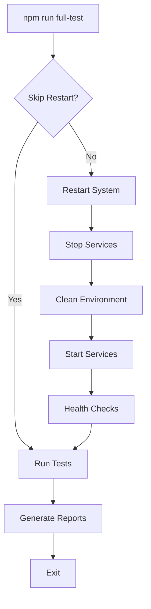

# 🔄 Sistema de Restart Integrado

## Visão Geral

O sistema de restart integrado garante que todos os serviços sejam reiniciados de forma coordenada antes da execução dos testes, proporcionando um ambiente limpo e consistente.

## 🎯 Objetivos

- **Ambiente Limpo**: Garantir que cada execução de teste comece com um estado conhecido
- **Consistência**: Eliminar falsos positivos causados por estados residuais
- **Automatização**: Reduzir intervenção manual no processo de testes
- **Confiabilidade**: Aumentar a confiabilidade dos resultados dos testes

## 🚀 Como Funciona

### 1. Integração Automática

Quando você executa:
```bash
npm run full-test
```

O sistema automaticamente:
1. 🛑 Para todos os serviços em execução
2. 🧹 Limpa portas e processos residuais
3. ⏳ Aguarda estabilização do ambiente
4. 🚀 Reinicia todos os serviços necessários
5. 🔍 Executa health checks (opcional)
6. 🧪 Inicia a execução dos testes

### 2. Scripts Disponíveis

```bash
# Teste completo com restart automático
npm run full-test

# Teste sem restart (mais rápido para desenvolvimento)
npm run full-test:no-restart

# Apenas restart do sistema
npm run restart-system

# Restart sem health checks (mais rápido)
npm run restart-system:skip-health

# Validação do sistema de testes
npm run validate-tests
```

### 3. Scripts PowerShell Integrados

O sistema mantém compatibilidade com scripts PowerShell existentes:

```powershell
# Script PowerShell que chama o sistema JavaScript
.\scripts\restart-all.ps1

# Script com opções
.\scripts\restart-all.ps1 -SkipChecks
```

## ⚙️ Configuração

### Opções de Linha de Comando

**Para full-test:**
- `--skip-restart`: Pula a reinicialização (útil durante desenvolvimento)
- `--ci`: Modo CI/CD (configurações otimizadas para pipelines)

**Para restart-system:**
- `--skip-health-checks`: Pula verificações de saúde após restart
- `--timeout <ms>`: Timeout personalizado para operações

### Exemplos de Uso

```bash
# Desenvolvimento rápido (sem restart)
npm run full-test:no-restart

# CI/CD com restart completo
npm run full-test:ci

# Restart rápido durante desenvolvimento
npm run restart-system:skip-health

# Restart completo com verificações
npm run restart-system
```

## 🔧 Funcionamento Interno

### 1. Parada de Serviços

```javascript
// Finaliza processos Node.js, npm, turbo
await this.killProcesses();

// Libera portas específicas (3000, 3001, 8080)
await this.freePorts();
```

### 2. Limpeza do Ambiente

```javascript
// Aguarda finalização completa
await this.waitForCleanup();

// Verifica se portas estão realmente livres
await this.verifyPortsAreFree();
```

### 3. Reinicialização

```javascript
// Inicia serviços usando scripts existentes
await this.startAllServices();

// Opcional: verifica se serviços estão funcionando
await this.verifyServices();
```

## 📊 Logs e Monitoramento

### Arquivos de Log

- `logs/restart.log`: Log detalhado das operações de restart
- `logs/test-execution.log`: Log da execução dos testes
- `logs/test-results-*.json`: Resultados estruturados em JSON

### Exemplo de Output

```
🔄 Iniciando reinicialização completa do sistema...

🛑 Parando todos os serviços...
   ✅ Processos node finalizados
   ✅ Processos npm finalizados
   ✅ Porta 3000 liberada
   ✅ Porta 3001 liberada

⏳ Aguardando limpeza completa...
   ✅ Limpeza concluída

🚀 Iniciando todos os serviços...
   ✅ Serviços iniciados

🔍 Verificando serviços...
   ✅ API: OK
   ✅ Web: OK

✅ Reinicialização completa bem-sucedida!
```

## 🔍 Verificação e Validação

### Health Checks Automáticos

O sistema verifica automaticamente:
- `http://localhost:3000/health`: Saúde geral da API
- `http://localhost:3000/health/live`: Liveness da API
- `http://localhost:3000/health/ready`: Readiness da API
- `http://localhost:3001`: Interface web

### Validação do Sistema

```bash
npm run validate-tests
```

Verifica:
- ✅ Estrutura de arquivos necessários
- ✅ Dependências instaladas
- ✅ Configuração correta
- ✅ Scripts disponíveis
- ✅ Arquivos de teste

## 🎯 Benefícios

### 1. **Consistência**
- Cada execução de teste começa com ambiente limpo
- Elimina interferências entre execuções

### 2. **Confiabilidade**
- Reduz falsos positivos
- Aumenta confiança nos resultados

### 3. **Automação**
- Zero intervenção manual necessária
- Integração perfeita com CI/CD

### 4. **Flexibilidade**
- Pode ser pulado durante desenvolvimento
- Configurável via parâmetros

### 5. **Compatibilidade**
- Funciona com scripts PowerShell existentes
- Mantém funcionalidade legada

## 🔄 Fluxo de Execução



## 📚 Próximos Passos

Com o sistema de restart integrado implementado, você pode:

1. **Executar testes com confiança**: `npm run full-test`
2. **Desenvolver rapidamente**: `npm run full-test:no-restart`
3. **Integrar com CI/CD**: Scripts prontos para GitHub Actions
4. **Monitorar execuções**: Logs detalhados disponíveis
5. **Expandir funcionalidades**: Base sólida para novos recursos

---

*✨ Sistema de Restart Integrado - Garantindo ambientes limpos para testes confiáveis!*
